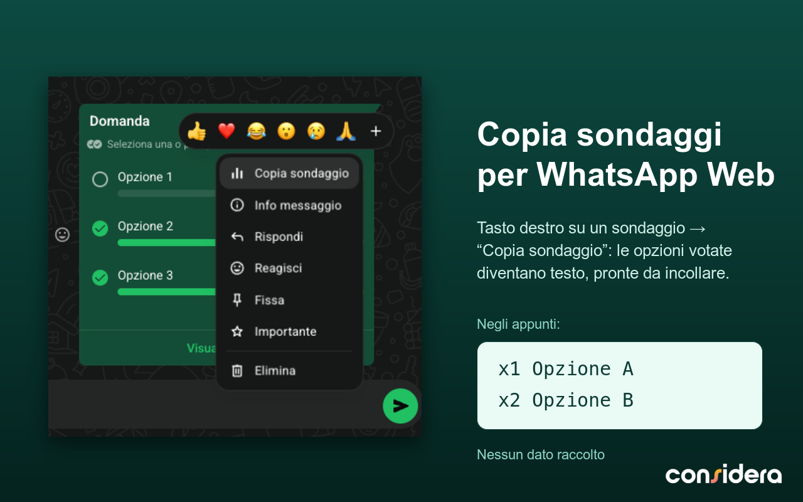

# Copia sondaggi per WhatsApp Web



Estensione Chrome che aggiunge la voce **"Copia sondaggio"** al menu dei messaggi di [WhatsApp Web](https://web.whatsapp.com).
Con un clic copia negli appunti le opzioni votate del sondaggio nel formato `x{voti} opzione`, una per riga — pronte da incollare in una nota, un foglio o una chat.

## Come si usa

1. Apri `web.whatsapp.com`
2. Apri il menu (tasto destro o freccia) su un messaggio con sondaggio
3. Scegli **"Copia sondaggio"**
4. Incolla dove vuoi

Esempio di risultato:

```
x8 Opzione A
x4 Opzione B
x3 Opzione C
```

## Caratteristiche

- Copia solo le opzioni con almeno un voto, mantenendo l'ordine del sondaggio
- Nessuna configurazione: funziona subito
- Non raccoglie, memorizza o trasmette alcun dato — tutto avviene in locale nel browser

## Struttura del progetto

- `estensione/` — estensione Chrome (`manifest.json`, `content.js`, icone, materiali per lo store)
- `wa-copy-poll.user.js` — versione userscript (Tampermonkey/Violentmonkey)

## Installazione (modalità sviluppatore)

1. Vai su `chrome://extensions`
2. Attiva la **Modalità sviluppatore**
3. **Carica estensione non pacchettizzata** → seleziona la cartella `estensione/`

---

Estensione indipendente, non affiliata né approvata da WhatsApp o Meta. "WhatsApp" è un marchio dei rispettivi proprietari.
